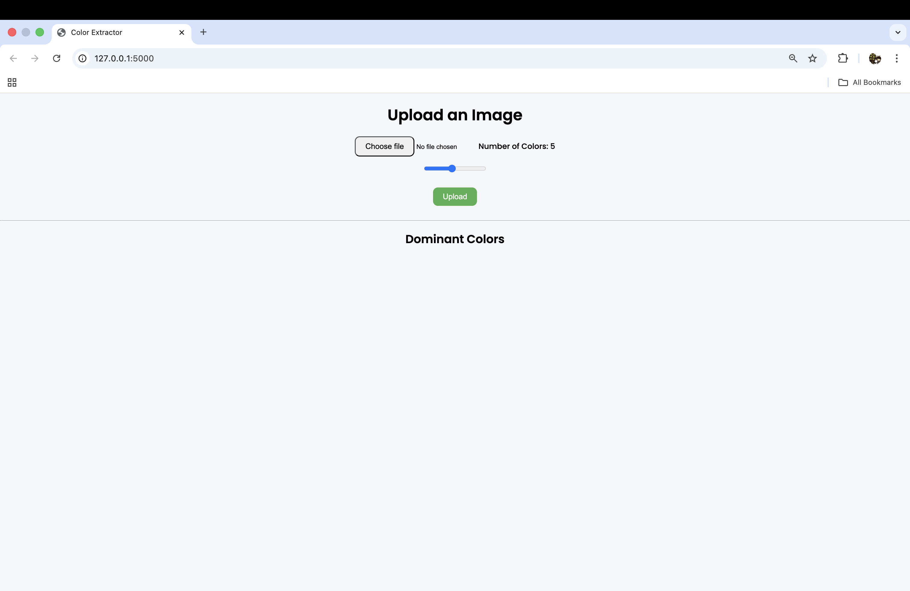
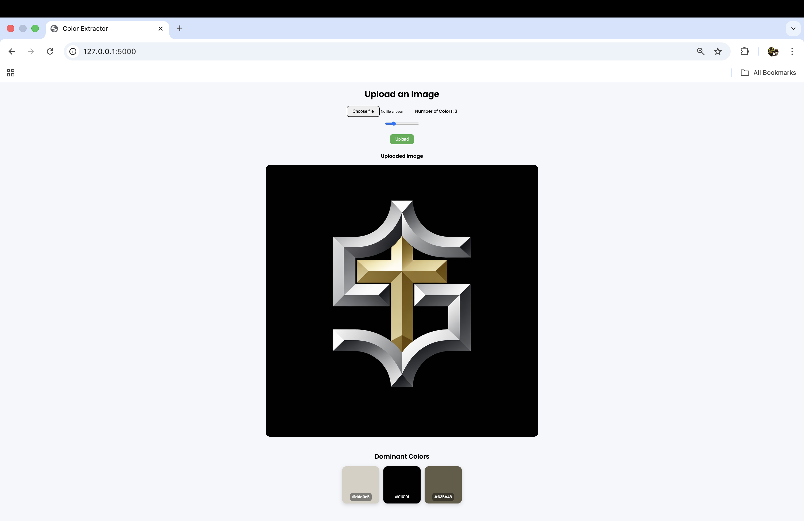
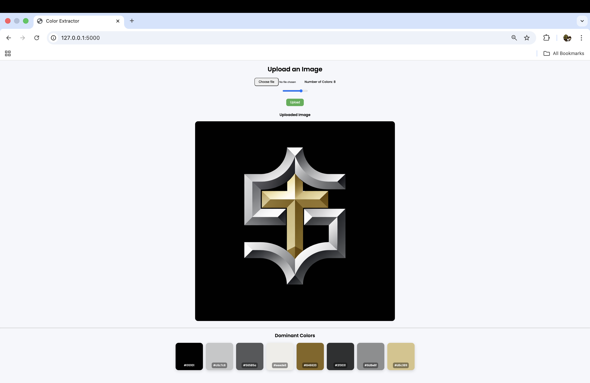

# 🎨 Image Color Palette Generator

A web app that extracts dominant colors from an uploaded image using machine learning.

---

## 🖼️ Preview

### Homepage

### Example Output 1

### Example Output 2

---

## 🚀 Features

- Upload an image  
- Choose number of colors  
- Extract dominant colors using KMeans  
- Copy HEX codes  

---

## 🛠️ Tech Stack

- Flask  
- NumPy  
- Pillow  
- scikit-learn  

---

## ▶️ Run Locally

pip install -r requirements.txt  
python app.py  

Open in browser:  
http://127.0.0.1:5000/

---

## 📁 Project Structure

.
├── static/  
│   ├── css/  
│   ├── uploads/  
│   └── screenshots/  
├── templates/  
│   └── index.html  
├── app.py  
├── utils.py  
├── requirements.txt  
├── .env  
└── .gitignore  

---

## ⭐️ Show Your Support

If you like this project, consider giving it a ⭐ on GitHub!

---

## 👤 Author

**Sijan Thapa**  
GitHub: https://github.com/FermiumParadox